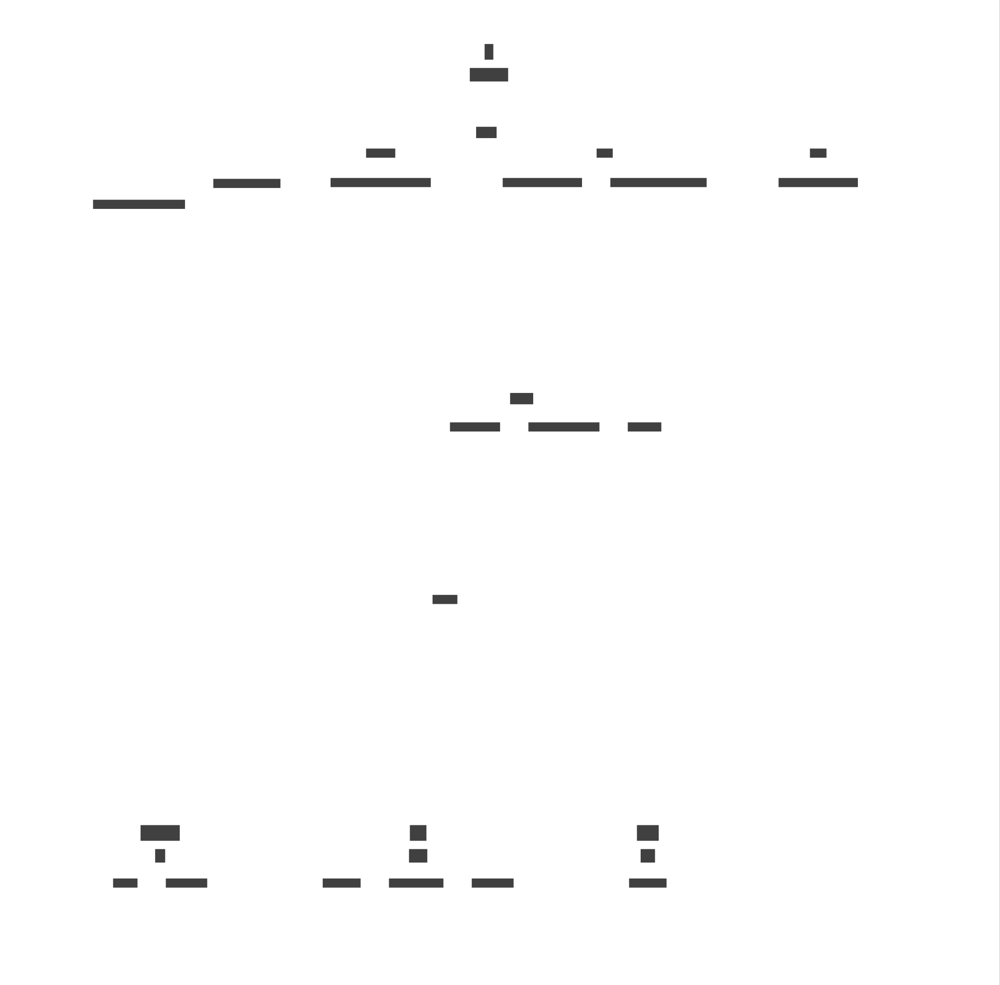

## description


A Java class named `Sample` that represents a sample data point with timestamp, value, and location information. It implements the `Parcelable` interface for serialization and deserialization purposes.

## code_explanation


The `Sample` class is designed to store and manage sample data points with timestamp, value, and location information. It provides methods for getting and setting the timestamp, value, and location fields. The class also implements the `Parcelable` interface to enable serialization and deserialization of the sample data points.

The `Sample` class has a constructor that initializes the timestamp, value, and location fields. It also has a constructor that takes a `JSONObject` as an argument, which is used to populate the timestamp, value, and location fields from the JSON object.

The class provides getter and setter methods for the timestamp, value, and location fields. The getter methods return the current value of the respective fields, while the setter methods update the value of the respective fields.

The `describeContents()` method is overridden to return an integer value of 0, indicating that no contents are present or needed.

The `writeToParcel()` method is overridden to write the timestamp and value parameters to a Parcel object using the specified flags for formatting.

The `CREATOR` field is a static final Parcelable.Creator instance that is used to create a new instance of the `Sample` class from a provided Parcel object.

The `fromJson()` method is used to convert an object of type `Sample` into a JSON object, including the timestamp and value properties.

## dependencies


### Built-in Libraries

*   `android.os.Parcel`: A class that provides a container for serializing and deserializing data.
*   `android.os.Parcelable`: An interface that is implemented by classes that can be serialized and deserialized.
*   `org.json.JSONArray`: A class that represents an array of JSON values.
*   `org.json.JSONObject`: A class that represents a JSON object.
*   `java.util.ArrayList`: A class that provides a resizable array implementation.

### Third-party Libraries

*   `None`: No third-party libraries are used in this code snippet.

### Custom Libraries

*   `None`: No custom libraries are used in this code snippet.

## security_insights


No security insights are available for this file.

## additional_information


*   The `Sample` class can be extended to include more features, such as validation and error handling.
*   The `fromJson()` method can be modified to handle different types of JSON objects.
*   The `Sample` class can be used in conjunction with other classes to create a more complex data structure.

### Example Usage

```java
Sample sample = new Sample();
sample.setTimestamp(1643723400);
sample.setValue(10.5);
sample.setLocation(new double[]{1.2, 3.4, 5.6});

JSONObject json = sample.toJson();
System.out.println(json.toString());

Parcel parcel = Parcel.obtain();
sample.writeToParcel(parcel, 0);
parcel.setDataPosition(0);
Sample sample2 = Sample.CREATOR.createFromParcel(parcel);
System.out.println(sample2.toString());
```
## usage_instructions

**Usage Instructions for Sample Class**

### Using the Sample Class

**Overview:**
The Sample class is a Java class that represents a sample data point with timestamp, value, and location information. This class implements the Parcelable interface for serialization and deserialization purposes.

**Step 1: Create an Instance of the Sample Class**

* Create a new instance of the Sample class using the default constructor: `Sample sample = new Sample();`
* Alternatively, you can create an instance of the Sample class by passing a JSONObject to the constructor: `Sample sample = new Sample(json);`

**Step 2: Set the Timestamp and Value Fields**

* Set the timestamp field using the `setTimestamp(long timestamp)` method: `sample.setTimestamp(System.currentTimeMillis());`
* Set the value field using the `setValue(double value)` method: `sample.setValue(10.5);`

**Step 3: Set the Location Field**

* Set the location field using the `setLocation(double[] location)` method: `sample.setLocation(new double[] {1.0, 2.0, 3.0});`

**Step 4: Get the Timestamp, Value, and Location Fields**

* Get the timestamp field using the `getTimestamp()` method: `long timestamp = sample.getTimestamp();`
* Get the value field using the `getValue()` method: `double value = sample.getValue();`
* Get the location field using the `getLocation()` method: `double[] location = sample.getLocation();`

**Step 5: Serialize and Deserialize the Sample Object**

* Serialize the Sample object using the `writeToParcel(Parcel dest, int flags)` method: `sample.writeToParcel(parcel, 0);`
* Deserialize the Sample object using the `createFromParcel(Parcel in)` method: `Sample sample = Sample.CREATOR.createFromParcel(parcel);`

**Example Usage:**

```java
import android.os.Parcel;
import android.os.Parcelable;

public class Main {
    public static void main(String[] args) {
        // Create a new instance of the Sample class
        Sample sample = new Sample();

        // Set the timestamp, value, and location fields
        sample.setTimestamp(System.currentTimeMillis());
        sample.setValue(10.5);
        sample.setLocation(new double[] {1.0, 2.0, 3.0});

        // Get the timestamp, value, and location fields
        long timestamp = sample.getTimestamp();
        double value = sample.getValue();
        double[] location = sample.getLocation();

        // Serialize and deserialize the Sample object
        Parcel parcel = Parcel.obtain();
        sample.writeToParcel(parcel, 0);
        Sample deserializedSample = Sample.CREATOR.createFromParcel(parcel);

        // Print the timestamp, value, and location fields
        System.out.println("Timestamp: " + timestamp);
        System.out.println("Value: " + value);
        System.out.println("Location: " + location[0] + ", " + location[1] + ", " + location[2]);
    }
}
```

By following these steps, you can successfully use the Sample class in your Java application.
